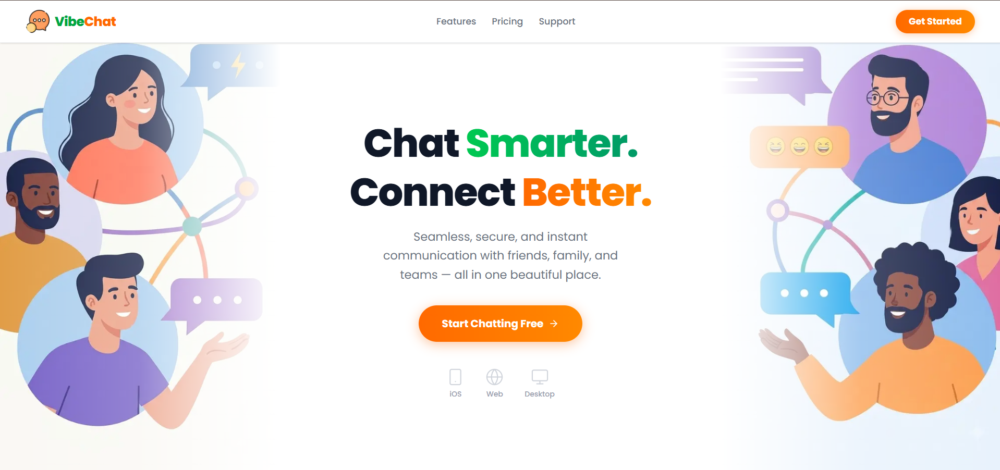
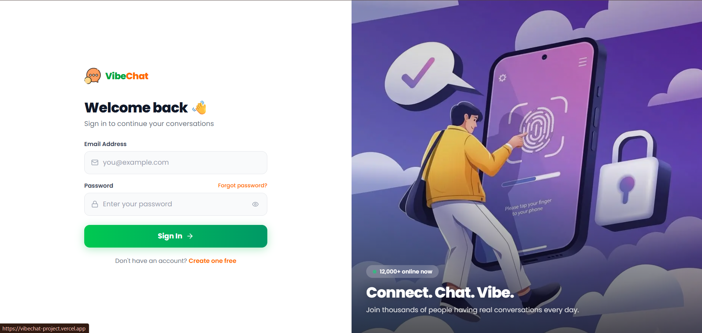
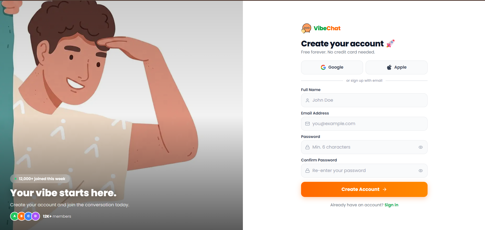
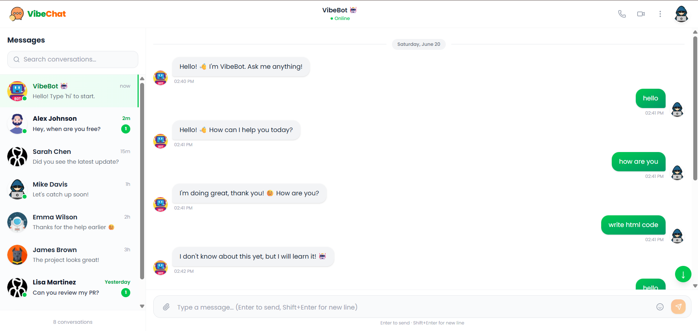
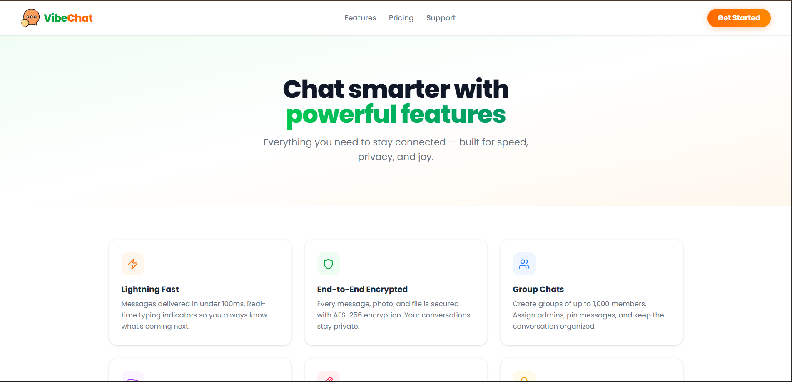
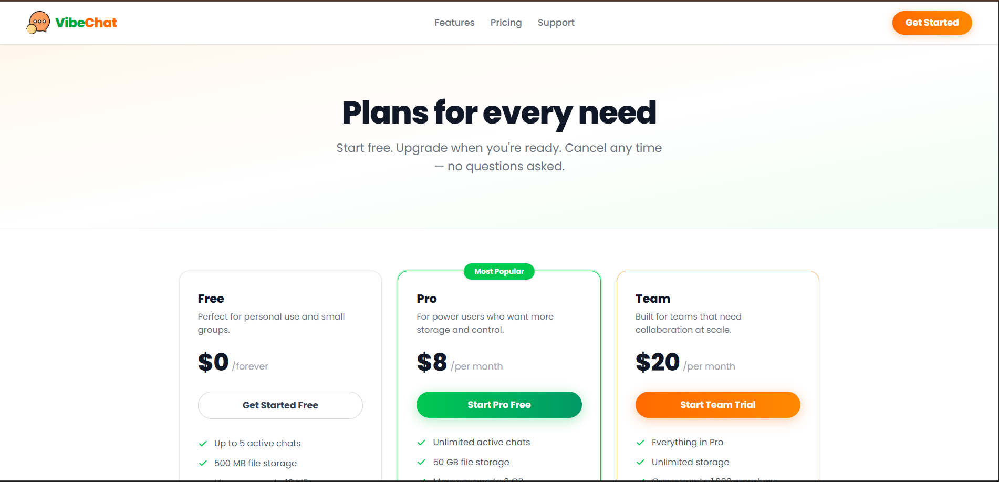
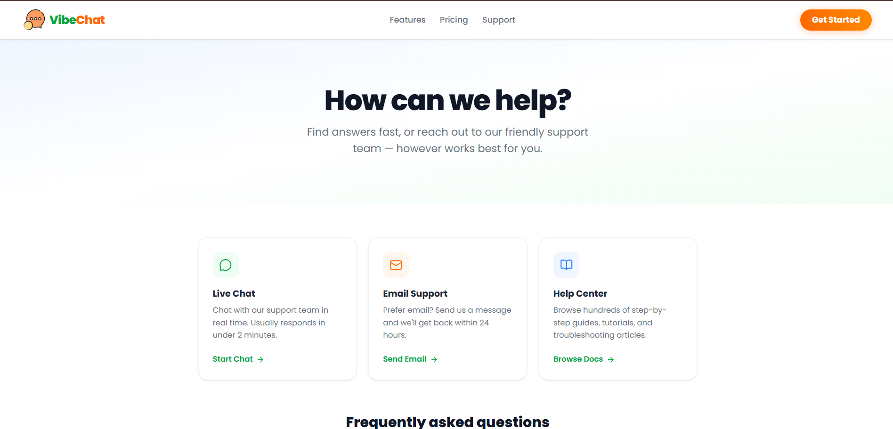

# VibeChat 💬



<p align="center">
  <strong>A modern and responsive chat interface built with Next.js and React.</strong>
</p>

<p align="center">
  Features chat persistence, typing indicators, accessibility support, responsive layouts, and a seamless user experience across devices.
</p>

---

## 🚀 Live Demo

🔗 **Live Demo:** https://vibechat-project.vercel.app/

🔗 **GitHub Repository:** https://github.com/DipanshukrGit/VibeChat

---

# 📌 About VibeChat

**VibeChat** is a modern chat interface developed using **Next.js 16**, **React 19**, and **Tailwind CSS 4** as part of the **Darwix AI Frontend Assessment**.

The application focuses on creating a smooth and accessible messaging experience while maintaining scalability, responsiveness, and clean code architecture.

It includes dynamic messaging, chat persistence, typing indicators, accessibility improvements, responsive layouts, and optimized UI performance.

> ⚠️ **Demo Authentication Notice**
>
> VibeChat is a **frontend-only application** and does not use a backend authentication system. The Login and Signup pages are included to demonstrate UI design, form validation, and user experience.
>
> To access the chat interface, you can use any valid email format and a password containing at least **6 characters**.
>
> **Example Credentials**
>
> Email: `demo@gmail.com`
> Password: `1234567`
>
> You may also use any other email and password combination that satisfies the validation requirements.


---

# ✨ Features

## 💬 Chat Experience

* Dynamic user and bot messages
* Distinct styling for user and bot chats
* Bot icon indicators
* Message timestamps
* Hover tooltip for timestamp details
* Multi-line message input
* Send messages using Enter key
* Send button support
* Auto-scroll to latest messages
* Chat persistence using Local Storage
* Typing indicator simulation
* Retry option for failed messages
* Smooth scrolling experience

---

## ♿ Accessibility

* Keyboard navigation support
* ARIA accessibility attributes
* Focus management
* Screen-reader friendly components
* Accessible form controls

---

## ⚡ Performance

* Optimized rendering
* Efficient chat history handling
* Scalable architecture
* Responsive layouts
* Smooth experience on mobile and desktop

---

## 🎨 User Interface

* Modern UI design
* Clean chat layout
* Responsive navigation
* Reusable components
* Mobile-friendly design
* Tailwind CSS styling

---

## 🔐 Authentication (Frontend Demo)

### Login Page

* Email validation
* Password validation
* Error handling
* Responsive design

### Signup Page

* Name validation
* Email validation
* Password strength indicator
* Password requirements helper
* User-friendly validation messages

---

# 📄 Pages Included

| Page     | Description                                   |
| -------- | --------------------------------------------- |
| Home     | Landing page with introduction and navigation |
| Login    | Frontend-only authentication screen           |
| Signup   | User registration UI with validations         |
| Chat     | Main chat interface                           |
| Features | Application features showcase                 |
| Pricing  | Pricing and plans page                        |
| Support  | Help and support resources                    |

---

# 📸 Screenshots

## 🏠 Home Page


---

## 🔐 Login Page



---

## 📝 Signup Page



---

## 💬 Chat Interface



---

## ⭐ Features Page



---

## 💰 Pricing Page



---

## 🛟 Support Page



---

# 🛠️ Tech Stack

### Frontend

* Next.js 16
* React 19
* React DOM 19
* JavaScript

### Styling

* Tailwind CSS 4

### Icons

* Lucide React

### State Management

* React Hooks
* Local Storage

### Tooling

* ESLint

---

# 📁 Folder Structure

```bash
vibechat/
│
├── app/
│   ├── (auth)/
│   │   ├── login/
│   │   └── signup/
│   │
│   ├── chat/
│   ├── features/
│   ├── pricing/
│   ├── support/
│   ├── components/
│   │
│   ├── globals.css
│   ├── layout.js
│   └── page.js
│
├── public/
│   ├── banner.png
│   ├── home.png
│   ├── login.png
│   ├── signup.png
│   ├── chat.png
│   ├── features.png
│   ├── plan.png
│   ├── support.png
│   └── logo.png
│
├── package.json
├── package-lock.json
├── next.config.mjs
├── eslint.config.mjs
├── jsconfig.json
└── README.md
```

---

# ⚙️ Installation

Clone the repository:

```bash
git clone https://github.com/DipanshukrGit/VibeChat.git
```

Move into the project directory:

```bash
cd VibeChat
```

Install dependencies:

```bash
npm install
```

Run development server:

```bash
npm run dev
```

Open:

```bash
http://localhost:3000
```

---

# ⚙️ Available Commands

| Command       | Description              |
| ------------- | ------------------------ |
| npm run dev   | Start development server |
| npm run build | Create production build  |
| npm run start | Run production build     |
| npm run lint  | Run ESLint checks        |

---

# 🎯 Darwix AI Assessment Coverage

### Layout Design

* ✅ Header section
* ✅ Scrollable chat area
* ✅ Fixed message input area
* ✅ Dynamic message rendering

### Message Design

* ✅ User messages
* ✅ Bot messages
* ✅ Bot indicators
* ✅ Message timestamps

### Functional Requirements

* ✅ Multi-line input
* ✅ Enter key submission
* ✅ Send button submission
* ✅ Auto-scroll behavior
* ✅ Error handling UI
* ✅ Retry functionality

### Accessibility

* ✅ Keyboard navigation
* ✅ ARIA support
* ✅ Focus management
* ✅ Screen reader compatibility

### Advanced Features

* ✅ Chat persistence
* ✅ Typing indicator
* ✅ Large chat history support

### Performance & Responsiveness

* ✅ Mobile responsive
* ✅ Tablet responsive
* ✅ Desktop responsive
* ✅ Optimized rendering

---

# 👨‍💻 Author

**Dipanshu Kumar**


